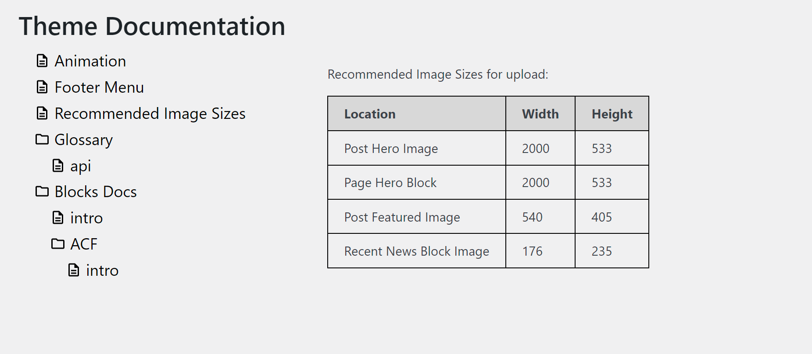

# Theme Docs

Adds a top level menu item in the admin for Theme Documentation.

The plugin scans a folder contained in the theme called /documentation for .md files and builds a menu tree that loads the .md file when clicked.

Note: Any images contained in the .md files should use either an absolute URL or the relative path from the site's root.  

EG:

`https://www.example.com/wp-content/uploads/2023/08/image.jpg` 

-or-

`/wp-content/themes/documentation/images/image/jpg`

## Filters
`theme_docs_path_to_docs` URL path to documents folder.

`theme_docs_uri_to_docs` URI path to documents folder.